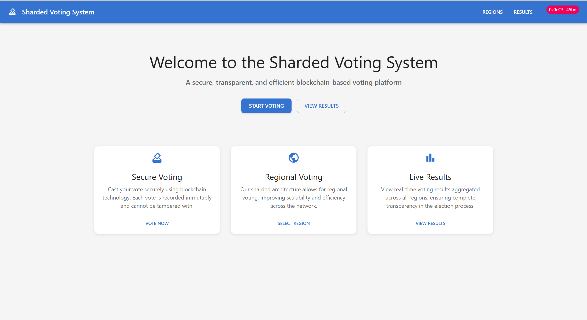
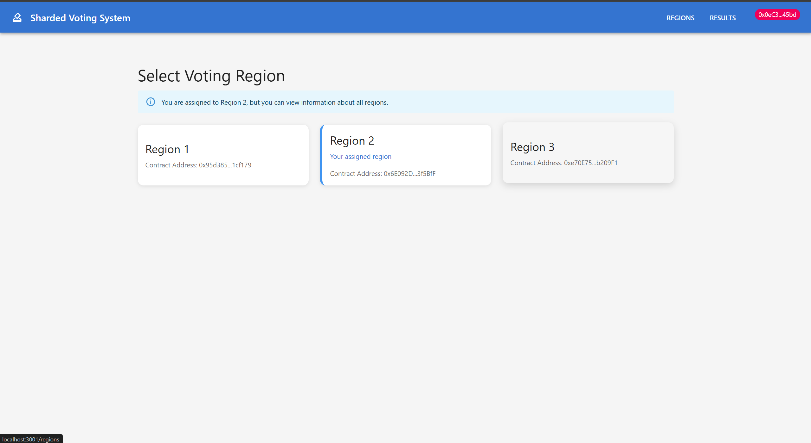
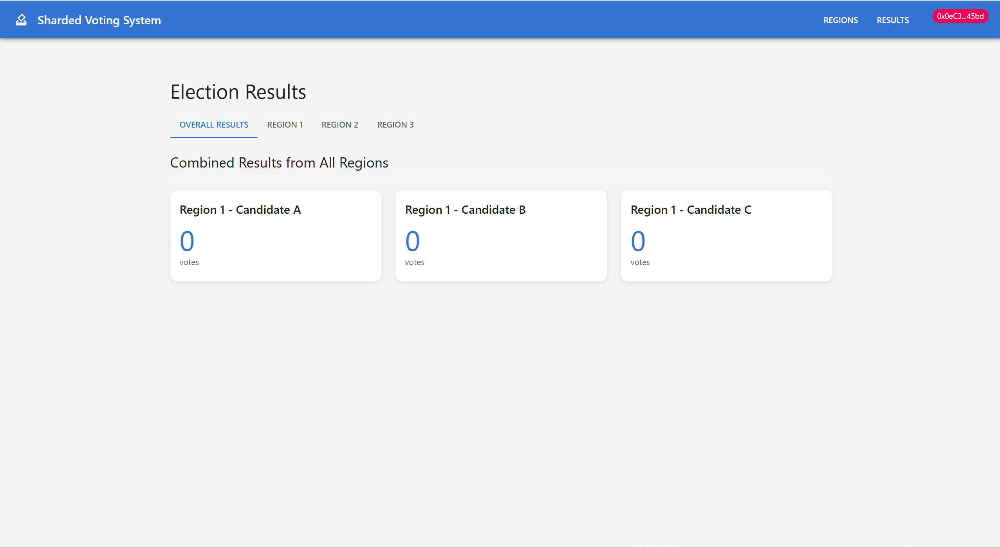
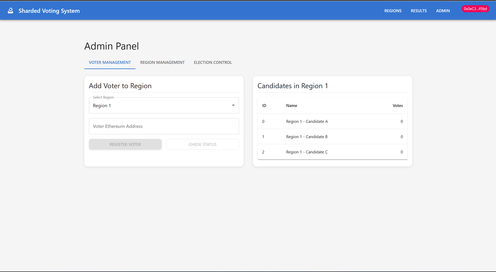
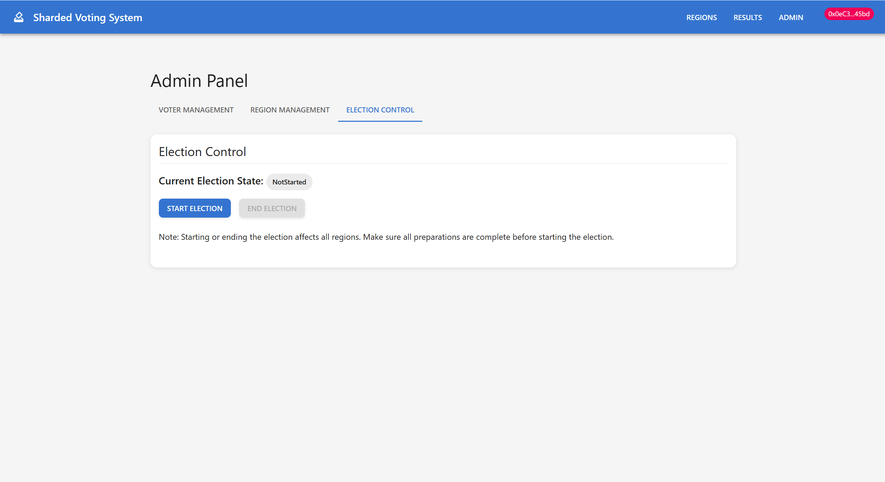

# Sharded Voting System

A decentralized voting system implementing blockchain sharding for enhanced scalability and performance.


## 📋 Table of Contents
- [Overview](#overview)
- [Features](#features)
- [Architecture](#architecture)
- [Sharding Explained](#sharding-explained)
- [Smart Contracts](#smart-contracts)
- [Frontend](#frontend)
- [Screenshots](#screenshots)
- [Setup and Installation](#setup-and-installation)
- [Usage](#usage)
- [Contributing](#contributing)
- [License](#license)
- [Publications](#publications)

## 🌟 Overview

The Sharded Voting System is a blockchain-based voting application that implements sharding technology to improve scalability and performance. This system allows for secure, transparent, and efficient voting processes across multiple regions while maintaining the integrity of the blockchain.


## ✨ Features

- **Multi-Region Support**: Handle voting processes across different regions
- **Sharded Architecture**: Improved scalability through blockchain sharding
- **Real-time Results**: Instant vote counting and result aggregation
- **Secure Voting**: Blockchain-based security and transparency
- **Admin Panel**: Comprehensive administration interface
- **Voter Authentication**: Secure voter verification system

## 🏗 Architecture

The system is built using a sharded architecture with the following components:

### Smart Contract Layer
- **RegionDeployment**: Manages region-specific voting instances
- **ShardVoting**: Handles individual shard operations
- **MainAggregator**: Aggregates results from all shards

### Frontend Layer
- React-based user interface
- Web3 integration for blockchain interaction
- Real-time updates and result visualization


## 🔄 Sharding Explained

### What is Sharding?
Sharding is a database partitioning technique that splits a database into smaller, more manageable pieces called "shards." In blockchain context, sharding helps improve scalability by:

1. **Parallel Processing**: Multiple shards can process transactions simultaneously
2. **Reduced Load**: Each node only needs to process a subset of transactions
3. **Improved Performance**: Faster transaction processing and validation

### How Sharding Works in This Project
1. **Region-based Sharding**: Each region operates as an independent shard
2. **Vote Distribution**: Votes are processed within their respective shards
3. **Result Aggregation**: The MainAggregator combines results from all shards


## 📜 Smart Contracts

### RegionDeployment.sol
- Manages region-specific voting instances
- Handles shard creation and management
- Coordinates with MainAggregator

### ShardVoting.sol
- Processes votes within individual shards
- Maintains vote integrity
- Implements voting logic

### MainAggregator.sol
- Aggregates results from all shards
- Provides global voting statistics
- Ensures data consistency

## 🎨 Frontend

The frontend is built using React and includes:

- **Voting Interface**: User-friendly voting experience
- **Admin Dashboard**: Comprehensive administration tools
- **Result Visualization**: Real-time result display
- **Region Selection**: Easy navigation between regions


## 🖼 Screenshots

Below are some UI screenshots of the project:

| Home Page | Region Selection | Results |
|-----------|------------------|---------|
|  |  |  |

| Add Voter | Election Control |
|-------------|------------------|
|  |  |

## 🚀 Setup and Installation

### Prerequisites
- Node.js (v14 or higher)
- Truffle
- Ganache
- MetaMask

### Installation Steps

1. Clone the repository:
```bash
git clone https://github.com/Satkrit4/ShardedVotingSystem.git
cd ShardedVotingSystem
```

2. Install dependencies:
```bash
npm install
cd voting-dapp/client
npm install
```

3. Start Ganache:
```bash
ganache-cli
```

4. Deploy smart contracts:
```bash
truffle migrate --reset
```

5. Start the frontend:
```bash
cd voting-dapp/client
npm start
```

## 💻 Usage

1. **Connect Wallet**: Connect your MetaMask wallet to the application
2. **Select Region**: Choose your voting region
3. **Cast Vote**: Select your candidate and submit your vote
4. **View Results**: Check real-time voting results

### Admin Functions
1. **Create Regions**: Set up new voting regions
2. **Add Candidates**: Add candidates to regions
3. **Monitor Votes**: Track voting progress
4. **View Analytics**: Access detailed voting statistics

## 🤝 Contributing

Contributions are welcome! Please feel free to submit a Pull Request.

1. Fork the repository
2. Create your feature branch (`git checkout -b feature/AmazingFeature`)
3. Commit your changes (`git commit -m 'Add some AmazingFeature'`)
4. Push to the branch (`git push origin feature/AmazingFeature`)
5. Open a Pull Request

## 📄 License

This project is licensed under the MIT License - see the [LICENSE](LICENSE) file for details.

## 📞 Contact

Satkrit - [@your_twitter](https://twitter.com/your_twitter)

Project Link: [https://github.com/Satkrit4/ShardedVotingSystem](https://github.com/Satkrit4/ShardedVotingSystem)

## 📚 Publications

- **Sharded Voting System: A Scalable Decentralized Architecture for Blockchain Elections**  
  Satkrit Rai, Ayush Mishra, Tejas Pandey  
  [Read the paper on IJIRT](https://ijirt.org/Article?manuscript=175978) 